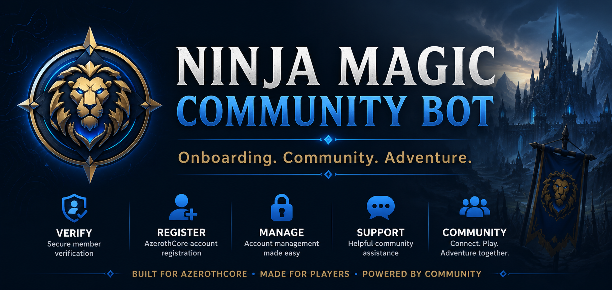

# Ninja Magic AzerothCore Discord Registration Bot

<p align="center">
  
</p>

<p align="center">
A modern Discord bot providing secure self-service account management for AzerothCore servers.
</p>

<p align="center">


</p>

------------------------------------------------------------------------


## Quick Start

> **Estimated installation time:** 15–30 minutes.

```bash
git clone <repository-url>
cd NinjaMagic-AzerothCore-Discord-Registration-Bot

python3 -m venv venv
source venv/bin/activate

pip install --upgrade pip
pip install -r requirements.txt

cp .env.example .env

python bot.py
```

------------------------------------------------------------------------


## Table of Contents

- [Overview](#overview)
- [Features](#features)
- [Architecture](#architecture)
- [Project Structure](#project-structure)
- [Requirements](#requirements)
- [Installation](#installation)
- [Discord Setup](#discord-setup)
- [AzerothCore Setup](#azerothcore-setup)
- [Database Setup](#database-setup)
- [Configuration](#configuration)
- [Running the Bot](#running-the-bot)
- [Production Deployment](#production-deployment)
- [Commands](#commands)
- [Testing](#testing)
- [Development Workflow](#development-workflow)
- [Logging](#logging)
- [Troubleshooting](#troubleshooting)
- [FAQ](#faq)
- [Roadmap](#roadmap)
- [Contributing](#contributing)
- [Security](#security)
- [License](#license)
- [Acknowledgements](#acknowledgements)

------------------------------------------------------------------------

# Overview

The **Ninja Magic AzerothCore Discord Registration Bot** automates
player account registration and password management for AzerothCore
servers using Discord slash commands and the AzerothCore SOAP interface.

Players can:

-   Register new game accounts
-   Change passwords
-   Manage multiple linked accounts

Administrators can enforce configurable security policies including
verified roles, account age requirements, registration cooldowns and
account limits.

------------------------------------------------------------------------

# Features

## Account Management

-   Discord slash commands
-   Self-service registration
-   Password changes
-   Multiple linked accounts
-   Automatic stale account cleanup

## Discord User Interface

- Interactive `/help`
- Rich Discord embeds
- Buttons and Views
- Registration modal
- Password confirmation
- Ephemeral responses
- Modern slash command interface

## Security

-   Verified role requirement
-   Discord account age requirement
-   Registration cooldown
-   Maximum linked accounts
-   Reserved username protection
-   Username/password validation
-   Bot Admin bypass
-   Discord Administrator bypass

## Logging

-   Registration audit log
-   SQLite database
-   File logging
-   Console logging
-   Configurable log level

------------------------------------------------------------------------

# Architecture

Discord
    │
    ▼
Slash Commands
    │
    ▼
Commands
    │
    ▼
UI Layer
(Embeds • Views • Modals)
    │
    ▼
Services
 ┌──────────────┴──────────────┐
 ▼                             ▼
SQLite                 AzerothCore SOAP
                                │
                                ▼
                     AzerothCore Auth Database

------------------------------------------------------------------------

# Project Structure

```text
bot.py                  Entry point
commands/               Slash commands
services/               Business logic
ui/                     Embeds, buttons, modals and views
database/               SQLite database layer
constants/              Shared constants
utils/                  Helper utilities
tests/                  Unit tests
docs/                   Project documentation
logs/                   Runtime logs
```

The project follows a layered architecture that keeps Discord interaction,
business logic and data access separate.

This makes the project easier to maintain, test and extend.
------------------------------------------------------------------------

# Requirements

- Debian 13 (tested)
- Python 3.14+
- AzerothCore
- MySQL 8+
- Discord.py 2.x
- Git

------------------------------------------------------------------------

# Installation

## Install prerequisites

``` bash
apt update
apt install git python3 python3-venv python3-pip -y
```

## Clone the repository

``` bash
git clone <repository-url>
cd NinjaMagic-AzerothCore-Discord-Registration-Bot
```

## Create a virtual environment

``` bash
python3 -m venv venv
source venv/bin/activate
```

## Install dependencies

``` bash
pip install --upgrade pip
pip install -r requirements.txt
```

------------------------------------------------------------------------

# Discord Setup

1.  Visit the Discord Developer Portal:
    https://discord.com/developers/applications
2.  Create a new Application.
3.  Create a Bot.
4.  Copy the Bot Token.
5.  Enable **Server Members Intent**.
6.  Invite the bot with the `bot` and `applications.commands` scopes.

Create these Discord roles:

-   **Verified** (or the value of `REQUIRED_DISCORD_ROLE`)
-   **Bot Admin** (or the value of `BOT_ADMIN_ROLE`)

------------------------------------------------------------------------

# AzerothCore SOAP

Enable SOAP in your AzerothCore configuration.

``` ini
SOAP.Enabled = 1
SOAP.IP = "0.0.0.0"
SOAP.Port = 7878
SOAP.Username = "soapuser"
SOAP.Password = "yourpassword"
```

Restart AzerothCore after making changes.

If the bot runs on another machine, ensure your firewall allows access
to the SOAP port.

------------------------------------------------------------------------

# AzerothCore Database Access

The bot requires read access to the AzerothCore **auth** database in
order to verify linked accounts.

Account creation and password changes are performed via SOAP.

------------------------------------------------------------------------

# Configuration

Copy the example configuration:

``` bash
cp .env.example .env
```

The `.env` file contains settings such as:

-   DISCORD_TOKEN
-   GUILD_ID
-   SOAP_HOST
-   SOAP_PORT
-   SOAP_USERNAME
-   SOAP_PASSWORD
-   MYSQL_HOST
-   MYSQL_PORT
-   MYSQL_DATABASE
-   MYSQL_USER
-   MYSQL_PASSWORD
-   LOG_LEVEL
-   MAX_ACCOUNTS_PER_DISCORD
-   REGISTRATION_COOLDOWN_MINUTES
-   REQUIRED_DISCORD_ROLE
-   BOT_ADMIN_ROLE
-   MINIMUM_DISCORD_ACCOUNT_AGE_DAYS

------------------------------------------------------------------------

# Running the Bot

## Development

After activating the virtual environment:

```bash
bot-start
```

Useful helper commands:

```bash
bot-status
bot-log
bot-restart
bot-stop
```

## Production

Deploy the bot using a `systemd` service so it starts automatically after boot.

------------------------------------------------------------------------

# Commands

| Command           | Description                      |
| ----------------- | -------------------------------- |
| `/help`           | Interactive help centre          |
| `/ping`           | Check bot status                 |
| `/register`       | Create an account                |
| `/myaccounts`     | View linked accounts             |
| `/changepassword` | Change a linked account password |
| `/setup`          | Configure the bot                |
| `/verifytest`     | Test the verification workflow   |


------------------------------------------------------------------------

# Testing

Before committing changes, run:

```bash
ruff check .
pytest
```

New features should include tests where practical to help maintain reliability.

------------------------------------------------------------------------

# Development Workflow

The project follows a layered architecture:

```text
Discord
   │
Commands
   │
UI
   │
Services
   │
Database / SOAP
```

General development guidelines:

- Run `ruff check .` before testing.
- Keep business logic inside `services/`.
- Keep Discord presentation inside `ui/`.
- Keep slash commands lightweight.
- Write reusable code whenever possible.

------------------------------------------------------------------------

# Production Deployment

For production deployments it is recommended to run the bot as a
`systemd` service so it starts automatically after boot and restarts if
it exits unexpectedly.

# Logging

Logs are written to:

``` text
logs/bot.log
```

Logging verbosity is controlled by:

``` text
LOG_LEVEL=INFO
```

------------------------------------------------------------------------

# Troubleshooting

Common issues:

-   SOAP connection refused
-   Incorrect Discord token
-   Missing Verified role
-   Registration cooldown active
-   MySQL connection failure
-   Slash commands not visible

------------------------------------------------------------------------

---

# FAQ

### Slash commands do not appear

Ensure the bot has been invited with the
`applications.commands` scope and allow Discord a few minutes to
synchronise commands.

### SOAP connection failed

Verify the SOAP configuration in AzerothCore and ensure the configured
port is reachable from the machine running the bot.

### Registration failed

Check:

- Discord role requirements
- Account age policy
- Username and password validation
- SOAP connectivity

### MySQL connection issues

Verify the configured database credentials and ensure the bot has access
to the AzerothCore authentication database.

------------------------------------------------------------------------

# Roadmap

## Version 1.2

Planned features include:

- Rich `/myaccounts` interface
- Character browser
- Improved account management
- Enhanced administrator commands
- Additional verification options
- More comprehensive audit reporting

Longer term goals:

- Multi-server support
- Localization
- Plugin architecture
- Web dashboard

------------------------------------------------------------------------

# Contributing

Issues and pull requests are welcome.

------------------------------------------------------------------------

# Security

The bot is designed with security in mind.

Features include:

- Discord role verification
- Discord account age requirements
- Username validation
- Password confirmation
- Account ownership verification
- SQLite account linking
- Configurable security policies

Passwords are processed through the AzerothCore SOAP interface and are
not stored by the Discord bot.

------------------------------------------------------------------------

## License

This project is licensed under the MIT License.

See the [LICENSE](LICENSE) file for details.

------------------------------------------------------------------------

# Acknowledgements

Special thanks to:

- AzerothCore
- Discord.py
- Python
- SQLite
- The AzerothCore community

This project has also benefited from AI-assisted development during its
design, documentation and implementation.
